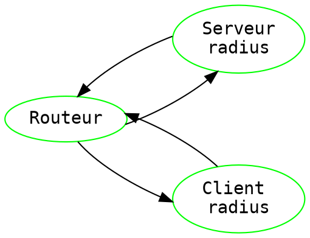

<h1 style="text-align:center">ATS01 - TP3 Radius</h1>
    

> [color=red] 1 - Questions préliminaires
1. 1. La commande permettant d'installer les paquets nécessaires sur le serveur sont les suivants:
   ``` bash=1
   # Installation freeradius
   $ apt-get install --no-install-suggests --no-install-recommends freeradius 
   # IP: 192.168.1.45
   ```
   2. La commande permettant d'installer les paquets nécessaires sur le client sont les suivants:
    ``` bash=1
    # Installation freeradius
    $ apt-get install --no-install-suggests --no-install-recommends freeradius
    # IP: 192.168.1.87
    
    # Installation module pam_radius_auth
    $ apt-get install libpam-radius-auth libpam0g-dev gcc
    ```
   3. Les configurations réseau de mes équipements sont les suivantes : 

> [color=red] 2 - Configuration du serveur Freeradius
2. 1. *  Le fichier **/etc/freeradius/3.0/radiusd.conf** contient la configuration principale du serveur **Freeradius**.
       * Le fichier **/etc/freeradius/3.0/clients.conf** contient les principales directives du client (souvent un NAS, Access Point, etc.) **Freeradius**.
        * Le fichier **/etc/freeradius/3.0/users** contient la sécurité et la configuration de l'authentification des informations pour chaque utilisateur de **Freeradius**.
  
    2.


