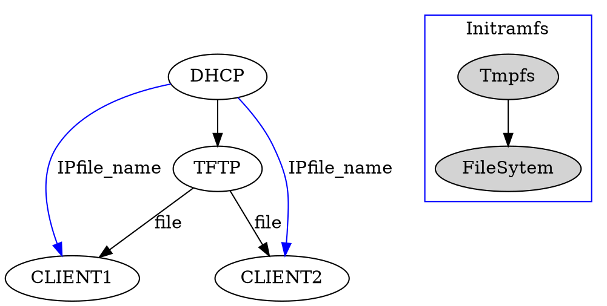

# Projet déploiement PXE
>[name=Pablo Théo Solen ] [color=#907bf7]
> [TOC]
## Definition du sujet
- **Problème:** Linux en salle de tp = tout claqué
- Mr Druon nous a proposé ce projet afin de répondre à un besoin. 
- Le but étant que en rentrant en tp, nous disposions d'une machine fonctionnelle. C'est-à-dire que sur la machine les outils pour le TD sont déjà installés. Plus de 
- Le besoin étant 
- **Solution:** Diffuser une ISO sur le réseau pour que toute les machines boot sur la même image.

## ToDo List
  - [x] Etude du fonctionnement de PXE + CR
  - [ ] Faire une tmpfs (Linux en RAMDISK) + CR
  - [ ] Création d'un script permettant d'automatiser la diffusion de l'iso
  - [ ] Création d'un outil permettant de créer ISO adapté pour chaque TP
  - [ ] Déploiement du serveur DHCP
  - [ ] Déploiement du serveur TFTP
  - [ ] Routage

## Contraintes

Authentification des utilisateurs

## Ports utilisés

voici les numéros de ports en UDP
PXE : 4011
DHCPD : 67
TFTPD : 69

## Principe du boot réseaux et Ramdisk

# Amélioration possible : 
Mettre les fichiers des élèves sur un cloud pour qu'ils ne dépendent pas de l'ordi du prof.

# Questions Druon 
 - Nous ne savons pas comment créer de façon personnalisé des OS, pourriez vous nous donnez de simples pistes ? Sachant que nous avions déjà trouvé comment effectuer cette opération sous Debian (avec liveDebian).
 - L'authentification doit-elle se faire au démarrage de la machine ou au moment du dêpot des fichiers sur le stockage partagé ? 
 - Afin d'assurer une authentification à la suite du boot réseau, pourrons nous utiliser le système d'authentification déjà présent à l'IUT (annuaire) ?

 
 
 
 
 
 
 
 
 